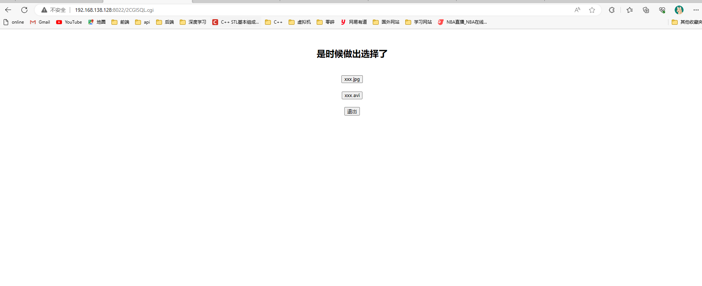

GXHWebserver
===


## 项目简介
Linux下基于C++开发的轻量级Web服务器，基于对于C++和网络编程学习的一个总结性学习项目，搭建了一个解析HTTP请求的服务器。

- 使用 **线程池+非阻塞socket+epoll（EL和LT均实现）+事件处理（Reactor和模拟Proactor均实现）** 的并发模型
- 使用主从状态机解析HTTP请求报文，支持解析GET和POST请求
- 采用数据库连接池，利用RAII思想利用类资源管理获取释放数据库连接对象，访问数据库连接池实现web端用户注册、登录功能，可以请求服务器图片和视频文件
- 实现同步/异步日志系统，记录服务器的运行状态
- 实现计时器处理非活动连接（基于升序链表和基于小顶堆），利用alarm来定时处理非活动连接
- 使用POSIX信号量、互斥锁、条件变量来实现多线程访问共享资源的同步
- 经过Webbench压力测试可以实现上万的并发连接数据交换

-------
## 目录结构介绍
CGImysql： 数据库连接池

config： 项目参数配置文件（若在命令行没有显示配置会采用文件中定义的默认配置）

http： 任务类，每个连接请求会处理的任务，包括IO单元，逻辑单元

lock： POSIX信号量、互斥锁、条件变量

press-test：webbench压力测试文件

root：服务器资源根目录

threadpool： 线程池以及线程的回调函数

timer：定时器处理非链接活动（小顶堆和升序链表）

util： 工具类，设置文件描述符状态以及事件监听表的注册，以及定时任务的回调函数

webserver： 主线程，设置监听套接字，注册epoll监听，进行循环epoll监听来进行调度

main： 主函数

makefile：编译可执行文件

---------
## 文件架构


----
## Demo演示

显示界面

----


注册界面

-----


登录界面

-----


home界面

-----


图片资源

-----


视频资源

-----


----

## 压力测试
在进行压力测试时先关掉日志，否则会极其影响并发性能，然后使用Webbench对服务器进行压力测试，对listenfd和connfd分别采取ET和LT模式，均可实现上万的并发连接，下面列出的是两者组合后的测试结果

> 测试环境
> 
> 在ubutun22.04.2 LTS  + mysql 8.0.33环境下进行测试
>
> 内存:8G 硬盘:20G

- 运行指令
```shell
sh ./test.sh
```
> 可以在test.sh里面修改ip 访问时间 并发数的参数

- LT + LT
```bash
guoxiaohui@guoxiaohui:~/GXHWebServer/pressure-test/webbench-1.5$ sh ./test.sh 
Webbench - Simple Web Benchmark 1.5
Copyright (c) Radim Kolar 1997-2004, GPL Open Source Software.

Benchmarking: GET http://192.168.138.128:8022/
4000 clients, running 5 sec.

Speed=2666964 pages/min, 6045009 bytes/sec.
Requests: 222247 susceed, 0 failed.
# -------------------
guoxiaohui@guoxiaohui:~/GXHWebServer/pressure-test/webbench-1.5$ sh ./test.sh 
Webbench - Simple Web Benchmark 1.5
Copyright (c) Radim Kolar 1997-2004, GPL Open Source Software.

Benchmarking: GET http://192.168.138.128:8022/
10000 clients, running 5 sec.

Speed=2859540 pages/min, 6469601 bytes/sec.
Requests: 238295 susceed, 0 failed.
```

- LT + ET
```bash
guoxiaohui@guoxiaohui:~/GXHWebServer/pressure-test/webbench-1.5$ sh ./test.sh 
Webbench - Simple Web Benchmark 1.5
Copyright (c) Radim Kolar 1997-2004, GPL Open Source Software.

Benchmarking: GET http://192.168.138.128:8022/
4000 clients, running 5 sec.

Speed=3047940 pages/min, 6906270 bytes/sec.
Requests: 253995 susceed, 0 failed.
# ---------------------
guoxiaohui@guoxiaohui:~/GXHWebServer/pressure-test/webbench-1.5$ sh ./test.sh 
Webbench - Simple Web Benchmark 1.5
Copyright (c) Radim Kolar 1997-2004, GPL Open Source Software.

Benchmarking: GET http://192.168.138.128:8022/
10000 clients, running 5 sec.

Speed=2590080 pages/min, 5847429 bytes/sec.
Requests: 215840 susceed, 0 failed.
```
- ET + LT
```bash
guoxiaohui@guoxiaohui:~/GXHWebServer/pressure-test/webbench-1.5$ sh ./test.sh 
Webbench - Simple Web Benchmark 1.5
Copyright (c) Radim Kolar 1997-2004, GPL Open Source Software.

Benchmarking: GET http://192.168.138.128:8022/
4000 clients, running 5 sec.

Speed=2934648 pages/min, 6648768 bytes/sec.
Requests: 244554 susceed, 0 failed.

guoxiaohui@guoxiaohui:~/GXHWebServer/pressure-test/webbench-1.5$ sh ./test.sh 
Webbench - Simple Web Benchmark 1.5
Copyright (c) Radim Kolar 1997-2004, GPL Open Source Software.

Benchmarking: GET http://192.168.138.128:8022/
10000 clients, running 5 sec.

Speed=2795556 pages/min, 6330800 bytes/sec.
Requests: 232963 susceed, 0 failed.
```

- ET + ET
```bash
guoxiaohui@guoxiaohui:~/GXHWebServer/pressure-test/webbench-1.5$ sh ./test.sh 
Webbench - Simple Web Benchmark 1.5
Copyright (c) Radim Kolar 1997-2004, GPL Open Source Software.

Benchmarking: GET http://192.168.138.128:8022/
4000 clients, running 5 sec.

Speed=2831436 pages/min, 6413869 bytes/sec.
Requests: 235953 susceed, 0 failed.
# -------------------
guoxiaohui@guoxiaohui:~/GXHWebServer/pressure-test/webbench-1.5$ sh ./test.sh 
Webbench - Simple Web Benchmark 1.5
Copyright (c) Radim Kolar 1997-2004, GPL Open Source Software.

Benchmarking: GET http://192.168.138.128:8022/
10000 clients, running 5 sec.

Speed=2992068 pages/min, 6777777 bytes/sec.
Requests: 249339 susceed, 0 failed.
```

- 并发访问总数:4000 / 10000
- 访问服务器时间: 5s
- 所有访问均成功

> 注意:使用centos可能在压力测试显示源码包有问题时,可以换ubutun系统进行压力测试,使用webbench进行测试时,若显示报错可删除后重新更新编译

## 快速运行

- 服务器环境
    - ubutun22.04.2 LTS  
    - mysql 8.0.33
- 浏览器测试环境
    - Windows 、 Linux均可
    - Chrome
    - edge
    - 其他浏览器暂无测试
- 测试前确认已安装Mysql数据库
```mysql
# 建立yourdb库
create database yourdb;

# 创建user表
USE yourdb;
CREATE TABLE user(
    username char(50) NULL,
    passwd char(50) NULL
)ENGINE=InnoDB;

# 添加数据
INSERT INTO user(username, passwd) VALUES('name', 'passwd');
```

- bulid
```shell
sh ./build.sh
```
- clean
```shell
sh ./clean.sh
```
- 启动server
```shell
./server
```
- 浏览器端口
    
    ip:8022

## 个性化运行
```bash
./server [-p port] [-l LOGWrite] [-m TRIGMode] [-o OPT_LINGER] [-s sql_num] [-t thread_num] [-c close_log] [-a actor_model]
```
> 以上选项可以不用全写，只需根据自己要求选填即可

- -p，自定义端口号

    默认8022
- -l，选择日志写入方式，默认同步写入

    0，同步写入
    1，异步写入
- -m，listenfd和connfd的模式组合，默认使用LT + LT

    0，表示使用LT + LT

    1，表示使用LT + ET

    2，表示使用ET + LT

    3，表示使用ET + ET
- -o，优雅关闭连接，默认不使用

    0，不使用
    1，使用
- -s，数据库连接数量
    默认为8
- -t，线程数量
    默认为8
- -c，关闭日志，默认打开

    0，打开日志

    1，关闭日志
- -a，选择反应堆模型，默认Proactor

    0，Proactor模型 0，Proactor模型
    1，Reactor模型 1，Reactor模型

测试示例命令与含义

```bash
./server -p 8022 -l 1 -m 0 -o 1 -s 10 -t 10 -c 1 -a 1
```

 端口8022
 异步写入日志
 使用LT + LT组合
 使用优雅关闭连接
 数据库连接池内有10条连接
 线程池内有10条线程
 关闭日志
 Reactor反应堆模型