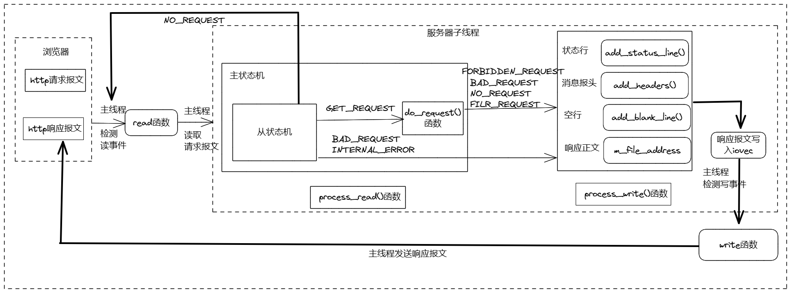

# 13 踩坑和面试题

## 本文内容

本篇是项目的最终篇，将介绍踩坑与面试题两部分。

**踩坑**，描述做项目过程中遇到的问题与解决方案。

**面试题**，介绍项目相关的知识点变种和真实面试题

## 踩坑

做项目过程中，肯定会遇到形形色色、大大小小的问题，但并不是所有问题都值得列出来探讨，这里仅列出个人认为有意义的问题。

具体的，包括大文件传输。

### **大文件传输**

先看下之前的大文件传输，也就是游双书上的代码，发送数据只调用了writev函数，并对其返回值是否异常做了处理。

```C++
 1bool http_conn::write()
 2{
 3    int temp=0;
 4    int bytes_have_send=0;
 5    int bytes_to_send=m_write_idx;
 6    if(bytes_to_send==0)
 7    {
 8        modfd(m_epollfd,m_sockfd,EPOLLIN);
 9        init();
10        return true;
11    }
12    while(1)
13    {
14        temp=writev(m_sockfd,m_iv,m_iv_count);
15        if(temp<=-1)
16        {
17            if(errno==EAGAIN)
18            {
19                modfd(m_epollfd,m_sockfd,EPOLLOUT);
20                return true;
21            }
22            unmap();
23            return false;
24        }
25        bytes_to_send-=temp;
26        bytes_have_send+=temp;
27        if(bytes_to_send<=bytes_have_send)
28        {
29            unmap();
30            if(m_linger)
31            {
32                init();
33                modfd(m_epollfd,m_sockfd,EPOLLIN);
34                return true;
35            }
36            else
37            {
38                modfd(m_epollfd,m_sockfd,EPOLLIN);
39                return false;
40            }
41        }
42    }
43}
```

在实际测试中发现，当请求小文件，也就是调用一次writev函数就可以将数据全部发送出去的时候，不会报错，此时不会再次进入while循环。

一旦请求服务器文件较大文件时，需要多次调用writev函数，便会出现问题，不是文件显示不全，就是无法显示。

对数据传输过程分析后，定位到writev的m_iv结构体成员有问题，每次传输后不会自动偏移文件指针和传输长度，还会按照原有指针和原有长度发送数据。

根据前面的基础API分析，我们知道writev以顺序iov[0]，iov[1]至iov[iovcnt-1]从缓冲区中聚集输出数据。项目中，申请了2个iov，其中iov[0]为存储报文状态行的缓冲区，iov[1]指向资源文件指针。

对上述代码做了修改如下：

- 由于报文消息报头较小，第一次传输后，需要更新m_iv[1].iov_base和iov_len，m_iv[0].iov_len置成0，只传输文件，不用传输响应消息头
- 每次传输后都要更新下次传输的文件起始位置和长度

更新后，大文件传输得到了解决。

```C++
 1bool http_conn::write()
 2{
 3    int temp = 0;
 4
 5    int newadd = 0;
 6
 7    if (bytes_to_send == 0)
 8    {
 9        modfd(m_epollfd, m_sockfd, EPOLLIN, m_TRIGMode);
10        init();
11        return true;
12    }
13
14    while (1)
15    {
16        temp = writev(m_sockfd, m_iv, m_iv_count);
17
18        if (temp >= 0)
19        {
20            bytes_have_send += temp;
21            newadd = bytes_have_send - m_write_idx;
22        }
23        else
24        {
25            if (errno == EAGAIN)
26            {
27                if (bytes_have_send >= m_iv[0].iov_len)
28                {
29                    m_iv[0].iov_len = 0;
30                    m_iv[1].iov_base = m_file_address + newadd;
31                    m_iv[1].iov_len = bytes_to_send;
32                }
33                else
34                {
35                    m_iv[0].iov_base = m_write_buf + bytes_have_send;
36                    m_iv[0].iov_len = m_iv[0].iov_len - bytes_have_send;
37                }
38                modfd(m_epollfd, m_sockfd, EPOLLOUT, m_TRIGMode);
39                return true;
40            }
41            unmap();
42            return false;
43        }
44        bytes_to_send -= temp;
45        if (bytes_to_send <= 0)
46
47        {
48            unmap();
49            modfd(m_epollfd, m_sockfd, EPOLLIN, m_TRIGMode);
50
51            if (m_linger)
52            {
53                init();
54                return true;
55            }
56            else
57            {
58                return false;
59            }
60        }
61    }
62}
```

## 面试题

包括项目介绍，线程池相关，并发模型相关，HTTP报文解析相关，定时器相关，日志相关，压测相关，综合能力等。

### **项目介绍**

- 为什么要做这样一个项目？

  ```
  1、对于Cpper来说能找到的项目,尤其是有详细资料的，确实不太多
  2、Webserver项目能够将一些常用的基础知识很好的串联起来，Webserver能够串联绝大部分的面试八股，C++/C语言本身特性，操作系统（含有大量的I/O系统调用及其封装，还有EPOLL等多路复用机制），计算机网络（本身就是一个网络框架，对HTTP请求报文的解析与响应，三次握手，保持连接，socket等），数据库（注册中心的登录注册验证），设计模式（数据库连接池，日志类的通过局部静态变量实现的懒汉模式实现）
  3、万物均能集成到Webserver中，Webserver本质上是一个高性能网络框架，他提供一个但服务端（也可以扩展成多服务端）与对各客户端的高效连接框架，短时客户端与服务端连接上以后具体应该做些什么（也就是说有哪些业务），这就可以由我们自由发挥了，这就是Webserver的功能扩展。
  ```

  

- 介绍下你的项目

```
本项目是一个Linux下基于C++开发的轻量级Web服务器，基于对于C++和网络编程学习的一个总结性学习项目，搭建了一个解析HTTP请求的服务器。
这个服务器主要是针对浏览器来进行访问，然后向服务器发起连接请求和HTTP请求报文获取资源，服务器对发送来的HTTP请求报文进行解析，然后对请求的资源以及请求错误做出响应，回发一个HTTP响应报文。基于这个主要功能，还实现了日志功能，有同步日志还有异步日志，来对服务器的运行状态和运行错误进行记录。应对高并发实现了（基于reactor和利用reactor模拟的proactorI/O模型的）半同步半反应堆事件处理模式的多线程系统，以及对文件描述符的LT和ET两种处理方法都有实现，采取线程池技术来避免多个线程的资源浪费，数据库连接池来进行用户登录与注册的校验功能，基于升序链表和小顶堆实现的定时器容器处理非活动连接。
```

- **这个web服务器是你自己申请的域名么？域名号是多少？**

  ```C++
  没有申请，因为服务器是放在同一网段的虚拟机里，然后在本地的浏览器里面访问。
  
  或者也可以在同一局域网的不同主机下实验，在同一局域网下通过私有IP+端口号就可以访问。
  
  又或者或者直接把服务器程序放在本地，然后使用本地回环地址127.0.0.1就可以。
  
  本地回环地址主要作用有两个：一是测试本机的网络配置，能PING通127.0.0.1说明本机的网卡和IP协议安装都没有问题；另一个作用是某些SERVER/CLIENT的应用程序在运行时需调用服务器上的资源，一般要指定SERVER的IP地址，但当该程序要在同一台机器上运行而没有别的SERVER时就可以把SERVER的资源装在本机，SERVER的IP地址设为127.0.0.1同样也可以运行。
  ```

  

### 线程池相关

- 手写线程池

  ```C++
   1template<typename T>
   2class threadpool{
   3    public:
   4        //thread_number是线程池中线程的数量
   5        //max_requests是请求队列中最多允许的、等待处理的请求的数量
   6        //connPool是数据库连接池指针
   7        threadpool(connection_pool *connPool, int thread_number = 8, int max_request = 10000);
   8        ~threadpool();
   9
  10        //像请求队列中插入任务请求
  11        bool append(T* request);
  12
  13    private:
  14        //工作线程运行的函数
  15        //它不断从工作队列中取出任务并执行之
  16        static void *worker(void *arg);
  17
  18        void run();
  19
  20    private:
  21        //线程池中的线程数
  22        int m_thread_number;
  23
  24        //请求队列中允许的最大请求数
  25        int m_max_requests;
  26
  27        //描述线程池的数组，其大小为m_thread_number
  28        pthread_t *m_threads;
  29
  30        //请求队列
  31        std::list<T *>m_workqueue;    
  32
  33        //保护请求队列的互斥锁    
  34        locker m_queuelocker;
  35
  36        //是否有任务需要处理
  37        sem m_queuestat;
  38
  39        //是否结束线程
  40        bool m_stop;
  41
  42        //数据库连接池
  43        connection_pool *m_connPool;  
  44};
  ```

  

- 线程的同步机制有哪些？

  ```
  信号量、互斥锁、条件变量、读写锁
  
  1、互斥锁（Mutex）
  互斥量是最简单的同步机制，即互斥锁。多个进程(线程)均可以访问到一个互斥量，通过对互斥量加锁，从而来保护一个临界区,防止其它进程(线程)同时进入临界区，保护临界资源互斥访问。
  互斥锁需要满足三个条件：
  	互斥 不同线程的临界区没有重叠
  	无死锁 如果一个线程正在尝试获得一个锁，那么总会成功地获得这个锁。若线程A调用lock()但是无法获得锁，则一定存在其他线程正在无穷次地执行临界区。
  	无饥饿 每一个试图获得锁的线程最终都能成功。
  
  2、条件变量（condition variable）
  生产者消费者问题：每次生产一个商品，发一个信号，告诉消费者“我生产商品了，快来消费”，消费者拿到生产者的条件变量后每次消费两个商品，然后发出信号“我消费了商品，你可以生产了”--_--（发的这个信号是一个条件变量，通过发送这个信号可以唤醒阻塞的线程，收到信号后，不满足需求也会继续阻塞）
  为了防止竞争，条件变量的使用总是和一个互斥锁结合在一起；条件变量是线程的另一种同步机制，它和互斥量是一起使用的。互斥量的目的就是为了加锁，而条件变量的结合，使得线程能够以等待的状态来迎接特定的条件发生，而不需要频繁查询锁。
  
  3、读写锁（reader-writer lock）
  前面介绍的互斥量加锁要么是锁状态，要么就是不加锁状态。而且只有一次只有一个线程可以对其加锁。这样的目的是为了防止变量被不同的线程修改。但是如果有线程只是想读而不会去写的话，这有不会导致变量被修改。但是如果是互斥量加锁，则读写都没有办法。这种场景不能使用互斥量，必须使用读写锁，提高性能。
  读写锁可以有3种状态：
  	读模式下加锁状态
  	写模式下加锁状态
  	不加锁状态
  一次只有一个线程可以占有写模式的读写锁，但是多个线程可以同时占有读模式的读写锁。当读写锁是写加锁状态时，在这个锁被解锁之前，所有试图对这个锁加锁的线程都会被阻塞。当读写锁在读加锁状态时，所有试图以读模式对它进行加锁的线程都可以得到访问权。但是任何希望以写模式对此锁进行加锁的线程都会阻塞。直到所有的线程释放它们的读锁为止。
  读写锁非常适合于对数据结构读的次数大于写的情况。当读写锁在写模式下时，它所保护的数据结构就可以被安全地修改，因为一次只有一个线程可以在写模式下拥有这个锁。
  读写锁也叫做共享互斥锁。当读写锁是读模式锁住的，就可以说是以共享模式锁住的。当它是写模式锁住的时候，就可以说成是以互斥模式锁住的。
  #include <pthread.h>
  Int pthread_rwlock_init(pthread_rwlock_t *restrict rwlock, const pthread_rwlockattr_t *restrict attr);
  Int pthread_rwlock_destroy(pthread_rwlock_t *rwlock);
  读写锁通过调用pthread_rwlock_init进行初始化。在释放读写锁占有的内存之前，需要调用pthread_rwlock_destroy做清理工作。如果pthread_rwlock_init为读写锁分配了资源，pthread_rwlock_destroy将释放这些资源。如果在调用pthread_rwlock_destroy之前就释放了读写锁占用的内存空间。那么分配给这个锁的资源就会丢失。
  要在读模式下锁定读写锁，需要调用pthread_rwlock_rdlock，要在写模式下锁定读写锁，需要调用pthread_rwlock_wrlock。不管以何种方式锁住读写锁。都可以调用pthread_rwlock_unlock进行解锁。
  Int pthread_rwlock_rdlock(pthread_rwlock_t *rwlock);
  Int pthread_rwlock_wrlock(pthread_rwlock_t *rwlock);
  Int pthread_rwlock_unlock(pthread_rwlock_t *rwlock);
  ```

  

- 线程池中的工作线程是一直等待吗？

  ```text
  线程池中的工作线程是处于一直阻塞等待的模式下的。因为在我们创建线程池之初时，我们通过循环调用pthread_create往线程池中创建了8个工作线程，工作线程处理函数接口为pthread_create函数原型中第三个参数函数指针所指向的worker函数（自定义的函数），然后调用线程池类成员函数run（自定义）。-------这里可能会有疑问？为什么不直接将第三个参数直接指向run函数，而是要通过向worker中传入对象从而调用run呢？原因是因为我们已经将worker设置为静态成员函数，而我们都知道静态成员函数只能访问静态成员变量，所以为了能够访问到类内非静态成员变量，我们可以通过在worker中调用run这个非静态成员变量来达到这一要求。在run函数中，我们为了能够处理高并发的问题，将线程池中的工作线程都设置为阻塞等待在请求队列是否不为空的条件上，因此项目中线程池中的工作线程是处于一直阻塞等待的模式下的。
  ```

- 你的线程池工作线程处理完一个任务后的状态是什么？

  ```text
  这里要分两种情况考虑
  
  （1） 当处理完任务后如果请求队列为空时，则这个线程重新回到阻塞等待的状态
  
  （2） 当处理完任务后如果请求队列不为空时，那么这个线程将处于与其他线程竞争资源的状态，谁获得锁谁就获得了处理事件的资格。
  ```

- 如果同时1000个客户端进行访问请求，线程数不多，怎么能及时响应处理每一个呢？

  ```text
  首先这种问法就相当于问服务器如何处理高并发的问题。
  
  本项目中是通过对子线程循环调用来解决高并发的问题的。
  
  具体实现过程如下：
  
  如上文所述，我们在创建线程的同时时就调用pthread_detach将线程进行分离，这样就不用单独对工作线程进行回收，但是一般情况只要我们设置了分离属性，那么这个线程在处理完任务之后，也就是子线程结束后，资源会被自动回收。那这种情况下我们服务器基本就只能处理8个请求事件了（线程池里只有8个线程）。那怎么实现高并发的请求呢？可能会说让线程池里创建足够多的线程数，这当然是理想化的，现实中线程数量过大会导致更多的线程上下文切换，占用更多内存，这显然是不合理的。
  
  接下来所叙述的就是本项目中用来处理高并发问题的方法了：
  
  我们知道调用了pthread_detach的线程只有等到他结束时系统才会回收他的资源，那么我们就可以从这里下手了。我们通过子线程的run调用函数进行while循环，让每一个线程池中的线程永远都不会终止，说白了就是让他处理完当前任务就去处理下一个，没有任务就一直阻塞在那里等待。这样就能达到服务器高并发的要求，同一时刻8个线程都在处理请求任务，处理完之后接着处理，直到请求队列为空表示任务全部处理完成。
  ```

- 如果一个客户请求需要占用线程很久的时间，会不会影响接下来的客户请求呢，有什么好的策略呢?

  ```text
  会影响接下来的客户请求，因为线程池内线程的数量时有限的，如果客户请求占用线程时间过久的话会影响到处理请求的效率，当请求处理过慢时会造成后续接受的请求只能在请求队列中等待被处理，从而影响接下来的客户请求。
  
  应对策略：
  
  我们可以为线程处理请求对象设置处理超时时间, 超过时间先发送信号告知线程处理超时，然后设定一个时间间隔再次检测，若此时这个请求还占用线程则直接将其断开连接。
  ```

### **并发模型相关**

- 简单说一下服务器使用的并发模型？

  ```text
  本项目采用的是半同步/半反应堆并发模型，半同步/半反应堆并发模式是半同步/半异步的变体，将半异步具体化为某种事件处理模式.
  
  并发模式中的同步和异步
  > - 同步指的是程序完全按照代码序列的顺序执行
  > - 异步指的是程序的执行需要由系统事件驱动
  
  半同步/半异步模式工作流程
  > - 同步线程用于处理客户逻辑
  > - 异步线程用于处理I/O事件
  > - 异步线程监听到客户请求后，就将其封装成请求对象并插入请求队列中
  > - 请求队列将通知某个工作在**同步模式的工作线程**来读取并处理该请求对象
  
  半同步/半反应堆工作流程（以Proactor模式为例）
  > - 主线程充当异步线程，负责监听所有socket上的事件
  > - 若有新请求到来，主线程接收之以得到新的连接socket，然后往epoll内核事件表中注册该socket上的读写事件
  > - 如果连接socket上有读写事件发生，主线程从socket上接收数据，并将数据封装成请求对象插入到请求队列中
  > - 所有工作线程睡眠在请求队列上，当有任务到来时，通过竞争（如互斥锁）获得任务的接管权
  ```

  

- reactor、proactor、主从reactor模型的区别？

  ```text
  - reactor模式中，主线程(**I/O处理单元**)只负责监听文件描述符上是否有事件发生，有的话立即通知工作线程(**逻辑单元** )，读写数据、接受新连接及处理客户请求均在工作线程中完成。通常由**同步I/O**实现。
  - proactor模式中，主线程和内核负责处理读写数据、接受新连接等I/O操作，工作线程仅负责业务逻辑，如处理客户请求。通常由**异步I/O**实现。
  - 主从reactor
  基本概念
  Reactor：把IO事件分配给对应的handler处理
  Acceptor：处理客户端连接事件
  Handler：处理非阻塞的任务
  梳理下基于主从Reactor多线程模型的事件处理过程：
  
      Reactor主线程对象通过select监听连接事件，通过Acceptor处理连接事件
      当Acceptor处理连接事件后，主reactor将连接分配给从Reactor
      从Reactor将连接加入到连接队列进行监听，并创建handler进行各种事件处理
      当有新事件发生时，从reactor就会对用对应的handler处理
      handler读取数据后，分发给后面的worker线程处理
      worker线程池分配独立的worker线程进行处理并返回结果
      handler收到结果后再将结果返回给客户端
  在主从Reactor多线程模型中，父线程与子线程之间数据交互简单、责任明确，父线程只需接收新连接，后续的处理交给子线程完成即可；主从Reactor多线程模型中，Reactor线程拆分为mainReactor和subReactor两个部分，mainReactor只处理连接事件，读写事件交给subReactor来处理。业务逻辑还是由线程池来处理，mainRactor只处理连接事件，用一个线程来处理就好。处理读写事件的subReactor个数一般和CPU数量相等，一个subReactor对应一个线程，业务逻辑由线程池处理
  ```

- 你用了epoll，说一下为什么用epoll，还有其他复用方式吗？区别是什么？

```text
还有select和poll

epoll:
epoll最大的优点就是，当出现满足条件的事件时，直接返回的是一个个满足条件结构体保存在结构体数组中，不需要像select和poll那样还需要循环依次判断每个是否满足事件发生条件，或者说不需要专门的数组去记录满足的事件。epoll最适合链接的很多，同一时刻活动链接比较少，但是使用的很少的场景高并发低低传输的场景。另外epoll也可以突破最大文件上限。
缺点是：不能够跨平台。

而select业务逻辑复杂，需要自己去循环判断是否满足事件，而且不能突破最大文件上限。但优点就是可以跨平台所以保留了下来。
poll在select的基础上进行了改进，将添加事件和满足事件两者分离开来，并且可以突破最大上限。但是仍然需要自己判断或者添加数组，业务逻辑复杂。
elect和poll都只能工作在相对低效的LT模式下，而epoll同时支持LT和ET模式。
```

### **HTTP报文解析相关**

- 用了状态机啊，为什么要用状态机？

  ```text
  因为传统应用程序的控制流程基本是按顺序执行的：遵循事先设定的逻辑，从头到尾地执行。简单来说如果想在不同状态下实现代码跳转时，就需要破坏一些代码，这样就会造成代码逻辑混乱，代码显得十分复杂。所以我们必须采取不同的技术来处理这些情况。它能处理任何顺序的事件，并能提供有意义的响应——即使这些事件发生的顺序和预计的不同，有限状态机正是为了满足这方面的要求而设计的。每个状态都有一系列的转移，每个转移与输入和另一状态相关。当输入进来，如果它与当前状态的某个转移相匹配，机器转换为所指的状态，然后执行相应的代码。
  ```

- 状态机的转移图画一下

  

- https协议为什么安全？

  ```text
  https=http+TLS/SSL
  
  TLS/SSL协议位于应用层协议和TCP之间，构建在TCP之上，由TCP协议保证数据传输版的可靠性，任何数据到权达TCP之前，都经过TLS/SSL协议处理。
  
  https是加密传输协议，可以保障客户端到服务器端的传输数据安全。用户通过http协议访问网站时，浏览器和服务器之间是明文传输，这就意味着用户填写的密码、帐号、交易记录等机密信息都是明文，随时可能被泄露、窃取、篡改，被第三者加以利用。安装SSL证书后，使用https加密协议访问网站，可激活客户端浏览器到网站服务器之间的"SSL加密通道"（SSL协议），实现高强度双向加密传输，防止传输数据被泄露或篡改。
  ```

- https的ssl连接过程

  ```text
  1. 客户端提交https请求
  2. 服务器响应客户，并把证书公钥发给客户端
  3. 客户端验证证书公钥的有效性
  4. 有效后，会生成一个会话密钥
  5. 用证书公钥加密这个会话密钥后，发送给服务器
  6. 服务器收到公钥加密的会话密钥后，用私钥解密，获取会话密钥
  7. 客户端与服务器双方利用这个会话密钥加密要传输的数据进行通信
  ```

- GET和POST的区别

  |    请求方法    |                 GET                  |                  Post                  |
  | :------------: | :----------------------------------: | :------------------------------------: |
  |    参数位置    |             url的query中             | 一般在请求体content中，在query中也可以 |
  |    参数大小    | 受限于浏览器的url大小，一般不超过32K |                   1G                   |
  | 服务器数据接收 |               接收一次               |       根据数据大小，可分多次接收       |
  |    使用场景    |     从服务器获取数据，不做增删改     |    像服务器提交数据，如做增删改操作    |
  |     安全性     |        参数在url中，安全性低         |        相对于GET请求，安全性高         |

  

### **数据库登录注册相关**

- 登录说一下？

  ```text
  数据库登录分为：1.载入数据表 2.提取用户名和密码 3.注册和登录校验 4.页面跳转
  
  1.载入数据表就是把数据库的数据通过map容器传到服务器上。
  2.当从浏览器上输入用户的用户名和密码后，浏览器会接收一个post请求报文，服务器通过解析请求报文的消息体，解析出账号密码。
  3.根据解析出的账号密码，与map容器中保存账号密码进行对比校验，相符则成功登陆。注册账号时，同样将输入的账号密码与数据库已经存储的账号名进行对比校验，防止出现相同的账号名。如果不相同就加入数据库。
  4.当输入的账号密码与数据库的数据成功匹配，就将浏览器跳转到对应的界面。
  ```

  

- 你这个保存状态了吗？如果要保存，你会怎么做？（cookie和session）

  ```text
  Cookie实际上是一小段的文本信息。客户端请求服务器，如果服务器需要记录该用户状态，就使用response向客户端浏览器颁发一个Cookie。客户端浏览器会把Cookie保存起来。当浏览器再请求该网站时，浏览器把请求的网址连同该Cookie一同提交给服务器。服务器检查该Cookie，以此来辨认用户状态。服务器还可以根据需要修改Cookie的内容。
  Session是另一种记录客户状态的机制，不同的是Cookie保存在客户端浏览器中，而Session保存在服务器上。客户端浏览器访问服务器的时候，服务器把客户端信息以某种形式记录在服务器上。这就是Session。客户端浏览器再次访问时只需要从该Session中查找该客户的状态就可以了。
  
  如果说Cookie机制是通过检查客户身上的“通行证”来确定客户身份的话，那么Session机制就是通过检查服务器上的“客户明细表”来确认客户身份。Session相当于程序在服务器上建立的一份客户档案，客户来访的时候只需要查询客户档案表就可以了。
  session会话机制是一种服务器端机制，它使用类似于哈希表（可能还有哈希表）的结构来保存信息。
  cookies会话机制：cookie是服务器存储在本地计算机上的小块文本，并随每个请求发送到同一服务器。 Web服务器使用HTTP标头将cookie发送到客户端。在客户端终端，浏览器解析cookie并将其保存为本地文件，该文件自动将来自同一服务器的任何请求绑定到这些cookie。
  
  cookie和session的对比
  Cookie 				session
  浏览器 			  服务器
  不安全 			  安全
  不占用服务器，性能高 	 占用服务器，性能低
  存储空间小 			存储空间大
  本地计算机上的小块文件	哈希表结构存储信息
  ```

  

- 登录中的用户名和密码你是load到本地，然后使用map匹配的，如果有10亿数据，即使load到本地后hash，也是很耗时的，你要怎么优化？

  ```text
  数据存储的优化：
  1.数据结构的优化：为了保证数据库的一致性和完整性，在逻辑设计的时候往往会设计过多的表间关联，尽可能的降低数据的冗余。
  2.数据查询的优化：保证在实现功能的基础上，尽量减少对数据库的访问次数；通过搜索参数，尽量减少对表的访问行数,最小化结果集，从而减轻网络负担；能够分开的操作尽量分开处理，提高每次的响应速度；在数据窗口使用SQL时，尽量把使用的索引放在选择的首列；算法的结构尽量简单；
  3.对算法那的优化：尽量避免使用游标，因为游标的效率较差，如果游标操作的数据超过1万行，那么就应该考虑改写。.使用基于游标的方法或临时表方法之前，应先寻找基于集的解决方案来解决问题，基于集的方法通常更有效。
  4.建立高效的索引：创建索引一般有以下两个目的：维护被索引列的唯一性和提供快速访问表中数据的策略。大型数据库有两种索引即簇索引和非簇索引，一个没有簇索引的表是按堆结构存储数据，所有的数据均添加在表的尾部，而建立了簇索引的表，其数据在物理上会按照簇索引键的顺序存储，一个表只允许有一个簇索引
  ```

  

- 用的mysql啊，redis了解吗？用过吗？

  ```text
  1.mysql和redis的数据库类型
  mysql是关系型数据库，主要用于存放持久化数据，将数据存储在硬盘中，读取速度较慢。
  redis是NOSQL，即非关系型数据库，也是缓存数据库，即将数据存储在缓存中，缓存的读取速度快，能够大大的提高运行效率，但是保存时间有限。
  
  2.mysql的运行机制
  mysql作为持久化存储的关系型数据库，相对薄弱的地方在于每次请求访问数据库时，都存在着I/O操作，如果反复频繁的访问数据库。第一：会在反复链接数据库上花费大量时间，从而导致运行效率过慢；第二：反复的访问数据库也会导致数据库的负载过高，那么此时缓存的概念就衍生了出来。
  
  3.缓存
  缓存就是数据交换的缓冲区（cache），当浏览器执行请求时，首先会对在缓存中进行查找，如果存在，就获取；否则就访问数据库。
  缓存的好处就是读取速度快
  
  4.redis数据库
  redis数据库就是一款缓存数据库，用于存储使用频繁的数据，这样减少访问数据库的次数，提高运行效率。
  
  5.redis和mysql的区别总结
  （1）类型上
  从类型上来说，mysql是关系型数据库，redis是缓存数据库
  （2）作用上
  mysql用于持久化的存储数据到硬盘，功能强大，但是速度较慢
  redis用于存储使用较为频繁的数据到缓存中，读取速度快
  （3）需求上
  mysql和redis因为需求的不同，一般都是配合使用。
  ```

  ###  **定时器相关**

  - 为什么要用定时器？

    ```text
    服务器程序通常管理着众多定时事件，因此有效地组织这些定时事件，使之能在预期的时间点被触发且不影响服务器的主要逻辑，对于服务器的性能有着至关重要的影响。为此，我们要将每个定时事件分别封装成定时器，并使用某种容器类数据结构，比如链表、排序链表和时间轮，将所有定时器串联起来，以实现对定时事件的统一管理。
    本项目是为了方便释放那些超时的非活动连接，关闭被占用的文件描述符，才使用定时器。
    
    1.1：什么是定时事件？
    定时事件，是指固定一段时间之后触发某段代码，由该段代码处理一个事件。这里是删除非活动的epoll树上的注册事件，并关闭对应的socket，连接次数减一。
    
    1.2：什么是定时器？
    是指利用结构体或其他形式，将多种定时事件进行封装起来。这里只涉及一种定时事件，这里将该定时事件与连接资源封装为一个定时器类。具体包括连接资源、超时时间和回调函数，这里的回调函数指向定时事件。
    
    1.3：连接资源包括什么？
    连接资源包括客户端套接字地址、文件描述符和定时器
    
    1.4：超时时间
    超时时间=浏览器和服务器连接时刻 + 固定时间(TIMESLOT)，可以看出，定时器使用绝对时间作为超时值.
    
    1.5：什么是定时器容器？
    项目中的定时器容器为带头尾结点的升序双向链表，具体的为每个连接创建一个定时器，将其添加到链表中，并按照超时时间升序排列。
    
    1.6：什么是定时任务？
    将超时的定时器从链表中删除。
    
    1.7:什么是定时任务处理函数？
    定时任务处理函数，该函数封装在容器类中，具体的，函数遍历升序链表容器，根据超时时间，删除对应的到期的定时器，并调用回调函数（即定时事件）。
    
    (注意：定时任务处理函数在主循环中调用)
    ```

    

  - 说一下定时器的工作原理

    ```text
    服务器主循环为每一个连接创建一个定时器，并对每个连接进行定时。另外，利用升序时间链表容器将所有定时器串联起来，若主循环接收到定时通知，则在链表中依次执行定时任务处理函数。
    
    怎么通知主循环？
    利用alarm函数周期性地触发SIGALRM信号，信号处理函数利用管道通知主循环（注意，本项目信号处理函数仅仅发送信号通知程序主循环，将信号对应的处理逻辑放在程序主循环中，由主循环执行信号对应的逻辑代码。）
    ```

  - 双向链表啊，删除和添加的时间复杂度说一下？还可以优化吗？

    ```text
    a.添加的尾节点时间复杂度为O(n)，是因为本项目的逻辑是先从头遍历新定时器在链表的位置，如果位置恰好在最后，才插入在尾节点后，所以是O(n)。
    b.删除的复杂度都是O(1)，因为这里的删除都是已知目标定时器在链表相应位置的删除。（看1.7可知，函数遍历升序链表容器，根据超时时间，删除对应的到期的定时器）
    
    优化：
    a.在双向链表的基础上优化：
    添加在尾节点的时间复杂度可以优化：在添加新的定时器的时候，除了检测新定时器是否在小于头节点定时器的时间外，再先检测新定时器是否在大于尾节点定时器的时间，都不符合再使用常规插入。
    b.不使用双向链表，使用最小堆结构可以进行优化。
    ```

    

  - 最小堆优化？说一下时间复杂度和工作原理

    ```text
    时间复杂度：
    
    添加：O(lgn)
    删除：O(1)
    
    工作原理：
    将所有定时器中超时时间最小的一个定时器的超时值作为alarm函数的定时值。这样，一旦定时任务处理函数tick()被调用，超时时间最小的定时器必然到期，我们就可以在tick 函数中处理该定时器。然后，再次从剩余的定时器中找出超时时间最小的一个（堆），并将这段最小时间设置为下一次alarm函数的定时值。如此反复，就实现了较为精确的定时。
    ```

    

### **日志相关**

- 说下你的日志系统的运行机制？

  ```text
  1：单例模式（局部静态变量懒汉方法）获取实例
  
  2：主程序一开始Log::get_instance()->init()初始化实例。初始化后：服务器启动按当前时刻创建日志（前缀为时间，后缀为自定义log文件名，并记录创建日志的时间day和行数count）。如果是异步(通过是否设置队列大小判断是否异步，0为同步)，工作线程将要写的内容放进阻塞队列，还创建了写线程用于在阻塞队列里取出一个内容(指针)，写入日志。
  
  3：其他功能模块调用write_log()函数写日志。（write_log：实现日志分级、分文件、按天分类，超行分类的格式化输出内容。）里面会根据异步、同步实现不同的写方式。
  
  问题1.1：阻塞队列是什么？
  
  本项目将生产者-消费者模型封装为阻塞队列，使用循环数组实现队列，作为两者共享的缓冲区。
  ```

  

- 为什么要异步？和同步的区别是什么？

  ```text
  因为同步日志的，日志写入函数与工作线程串行执行，由于涉及到I/O操作，在单条日志比较大的时候，同步模式会阻塞整个处理流程，服务器所能处理的并发能力将有所下降，尤其是在峰值的时候，写日志可能成为系统的瓶颈。
  
  而异步日志采用生产者-消费者模型，工作线程将所写的日志内容先存入缓冲区，写线程从缓冲区中取出内容，写入日志。并发能力比较高。
  
  （工作线程就是生产者，写线程是消费者）
  
  2.1缓冲区用什么实现？
  本项目将生产者-消费者模型进行了封装，使用循环数组实现队列，作为两者共享的缓冲区。
  
  2.2：什么是生产者消费者模式？
  某个模块负责产生数据，这些数据由另一个模块来负责处理（此处的模块是广义的，可以是类、函数、线程、进程等）。产生数据的模块，就形象地称为生产者；而处理数据的模块，就称为消费者。
  
  单单抽象出生产者和消费者，还够不上是生产者／消费者模式。该模式还需要有一个缓冲区处于生产者和消费者之间，作为一个中介。生产者把数据放入缓冲区，而消费者从缓冲区取出数据。
  ```

  

- 现在你要监控一台服务器的状态，输出监控日志，请问如何将该日志分发到不同的机器上？（消息队列）

  ```text
  同一个机器：使用观察者模式（有的叫发布订阅模式）
  
  但是多机器，借助redis数据库的消息队列的发布订阅模式。实现分布式日志系统。
  ```

  

  ```
  **26、你的项目中用到哪些设计模式、**
  
  单例模式
  
  **27、懒汉模式和饿汉模式具体怎么实现**
  
  单例模式要两次判断的原因是，如果针对多线程，两个线程同时判断出指针为空，就会同时创建两个单例的指针，判断一次之后进行加锁后再创建实例，就可以避免有另一个同时判断成功也迅速创建了实例，因为加锁后另一个进程不能再进入。
  
  **28、单例模式会带来哪些问题？**
  单例模式一般没有接口，扩展困难。如果要扩展，则除了修改原来的代码，没有第二种途径，违背开闭原则。
  在并发测试中，单例模式不利于代码调试。在调试过程中，如果单例中的代码没有执行完，也不能模拟生成一个新的对象。
  单例模式的功能代码通常写在一个类中，如果功能设计不合理，则很容易违背单一职责原则。
  
  **29、有用过动态规划来解决实际问题吗？说一下它的思想？**
  动态规划最初是为了解决递归重复计算导致超时的问题，后来为了防止多次重复计算，引入了记忆化递归，但是记忆化递归仍然效率不是特别高，在记忆化递归的基础上改进后，形成了自上而下的动态规划方法。
  
  **30、你web服务器能说一下项目框架吗？**
  
  
  **32、那你说一下它的结构以及怎么工作的？**
  线程池最重要的是一个线程池数组和一个任务队列，在类的构造函数中创建一定数量的线程，并放到线程池数组中，然后主函数中将任务插入到请求队列中，已经创建的线程对队列中的任务进行抢夺，得到任务加锁进行处理，处理主要依靠线程的运行函数，该函数会调用http类里的解析函数对客户端的请求进行解析。并且调用数据库连接池导入数据。
  为了可以同时处理多个连接，需要在让一个线程的处理函数不间断的进行while循环
  
  **34、状态机设计机制是什么？你使用状态机给你项目带来哪些好处？**
  （自己编的）状态机就是用于不同状态转换的一种数学模型。
  设计机制：将程序中的不同状态进行整合，来保证不论状态发生的顺序如何，最后都能转移到需要的状态上。
  好处：项目中状态机主要用于对客户端请求的处理，其中有三种状态，处理请求行，处理请求头，处理请求体，有了状态机，一方面可以避免多种状态同时发生造成混乱。另一方面保证了状态处理结束后能够正确的进行状态转移，相比只有if进行判断更加安全可靠。
  
  35、有没有想过状态机会给项目带来哪些危害？
  缺点：状态机的缺点就是性能比较低，一般一个状态做一个事情，性能比较差，在追求高性能的场景下一般不用，高性能场景一般使用流水线设计。
  
  36、你在项目设计的过程中遇到过什么问题？是怎么解决的。
  ```

  

### **压测相关**

- 服务器并发量测试过吗？怎么测试的？

  ```
  webbench 
  通过-c指定客户端数量，-t指定访问时间 对项目的listenfd和connfd分别采用LT和ET模式分别进行了测试，结果显示，代码在上万的并发情况下是可以支持的，并且全部成功
  ```

- webbench是什么？介绍一下原理

  ```
  父进程fork若干个子进程，每个子进程在用户要求时间或默认的时间内对目标web循环发出实际访问请求，父子进程通过管道进行通信，子进程通过管道写端向父进程传递在若干次请求访问完毕后记录到的总信息，父进程通过管道读端读取子进程发来的相关信息，子进程在时间到后结束，父进程在所有子进程退出后统计并给用户显示最后的测试结果，然后退出。
  ```

- 测试的时候有没有遇到问题？

```
由于电脑性能的限制，虚拟机的内存资源有限，在并发过高的情况下发生资源的性能瓶颈，最后给虚拟机分配了8G的内存才足以支持上万并发的测试工作。并且通过ulimit -n调整了可以使用的文件句柄
再有就是日志系统也会影响并发能力，所以在测试的时候关闭了日志文件的功能。
```

### **综合能力**

- 你的项目解决了哪些其他同类项目没有解决的问题？

  ```
  大文件传输的问题
  由于每次使用writev都会顺序的从iovec[0]开始聚集写，所以在每次while循环执行writev时，都会调整iovec中base指针位置都长度
  ```

  

- 说一下前端发送请求后，服务器处理的过程，中间涉及哪些协议？

  ```
  在应用层使用了HTTP传输协议，如果通过HTTPS访问还会使用SSL加密协议，在传输层使用的TCP协议，路由选择使用的时IP协议
  ```

  